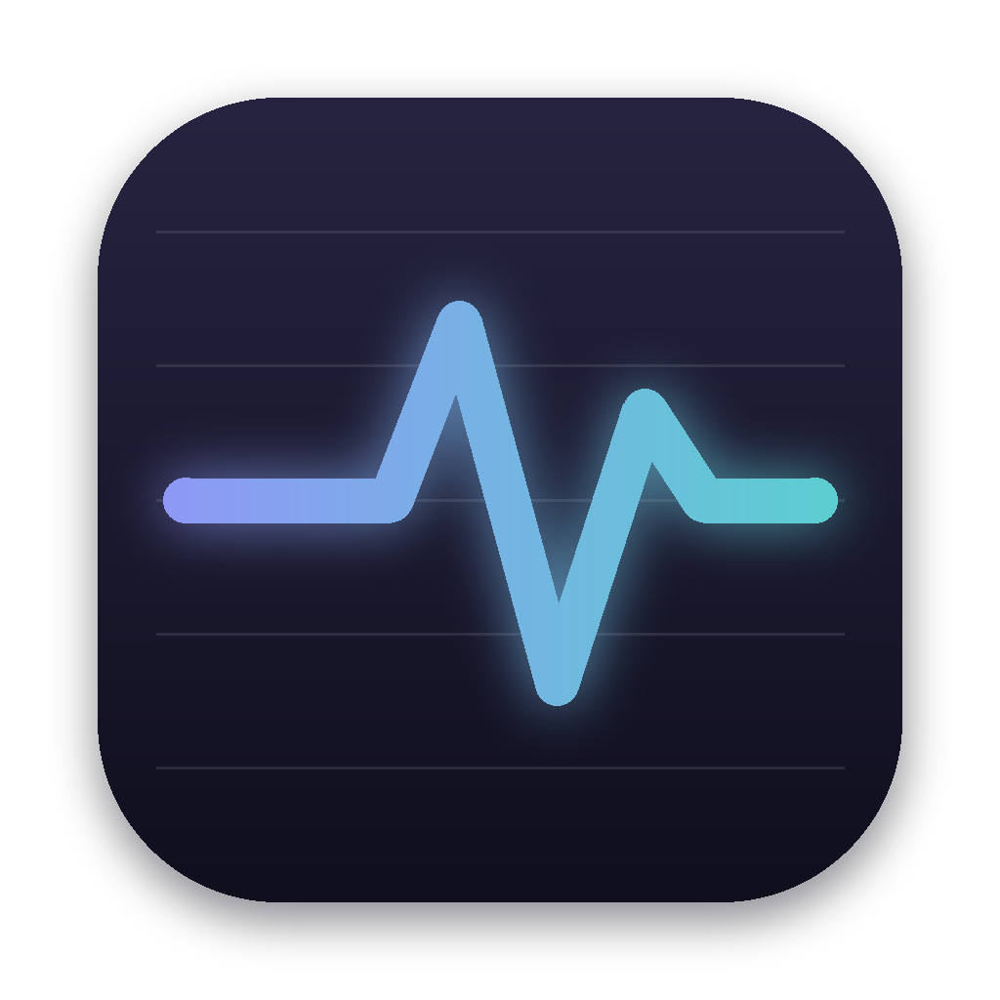

<p align="center">
  
</p>

<h1 align="center">Pulse</h1>

<p align="center">
  A system monitor that lives in the macOS menu bar.<br>
  <b>C++20 · Qt 6 / QML · Mach · IOKit · libproc · Objective-C++</b>
</p>

<p align="center">
  
</p>

<p align="center"><sub><b>English</b> · <a href="README.ru.md">Русский</a></sub></p>

---

Right next to the clock, Pulse shows live CPU load, memory usage and network speed. Click it to open a panel with charts and details.

## What it shows

- **CPU**: total load (user and system separately), a history chart, per-core load labeled E/P (Apple Silicon efficiency and performance cores), load average.
- **Memory**: usage split into the same categories as Activity Monitor (app, wired, compressed, cached), memory pressure, swap.
- **Network**: download and upload speed with charts, traffic since launch, interface and IP address.
- **GPU**: utilization.
- **Disk**: free space on the user volume.
- **Battery**: charge, time to empty or full, health, cycle count, temperature, adapter wattage.
- **Processes**: top by CPU or by memory, with app icons.
- **Thermal state**: a warning when macOS starts throttling the CPU.

## Architecture

```
src/
├── core/Metrics            # pure logic: CPU deltas, counter-based rates, formatting (tested)
├── platform/
│   ├── Probe_mac.mm        # host_processor_info, host_statistics64, sysctl, NET_RT_IFLIST2,
│   │                       # IOPowerSources, AppleSmartBattery, IOAccelerator, libproc
│   └── Native_mac.mm       # NSStatusItem, popover panel, SMAppService
├── app/
│   ├── SystemMonitor       # timed sampling, history, QML properties
│   ├── MenuBarRenderer     # draws the menu bar item with QPainter
│   ├── ProcessIcons        # app icons for QML
│   └── AppController       # settings, status item, panel positioning
qml/                        # panel: cards, charts on QtQuick.Shapes, settings
tests/                      # Qt Test
```

Notable decisions:

- **Two sampling modes.** While the panel is closed, only what the menu bar needs is read. Processes, battery details and disk are sampled only while the panel is open, so the app barely touches the CPU in the background.
- **Custom NSStatusItem.** `QSystemTrayIcon` can only show a square icon, while Pulse needs a variable-width item with live numbers. The image is painted with `QPainter` as a template image, so macOS recolors it for light and dark menu bars. Digits are tabular (`tnum`) so the item doesn't jitter on updates.
- **64-bit network counters** via `NET_RT_IFLIST2`: `getifaddrs` counters are 32-bit and wrap every 4 GB. Only physical interfaces (`en*`) are counted, otherwise VPN traffic would be counted twice.
- **Per-process CPU on Apple Silicon.** `proc_pidinfo` reports time in Mach ticks, not nanoseconds, so it's converted via `mach_timebase_info`. Without that, values would be ~41× too high.
- **Memory like Activity Monitor**: "used" = app + wired + compressed; processes use `phys_footprint`.

## Building

```bash
brew install qt cmake ninja

# development
cmake -S . -B build -G Ninja -DCMAKE_PREFIX_PATH="$(brew --prefix qt)"
cmake --build build && ctest --test-dir build
./build/Pulse.app/Contents/MacOS/Pulse

# standalone app + .dmg (+ install to /Applications)
./scripts/package.sh --install
```

Requires macOS 13+ on Apple Silicon or Intel. No special permissions needed.

## License

MIT
